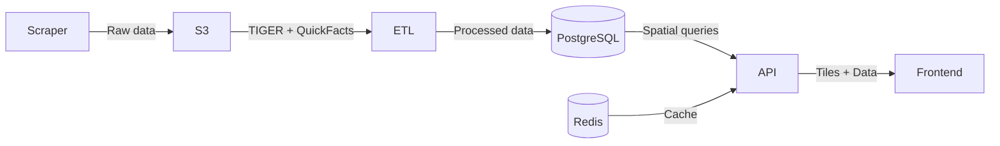

# Geospatial Data Analysis

A monorepo containing services for scraping, processing, and visualizing US Census geographic and demographic data.

## Repository Structure

```
.
├── services/           # Main services
│   ├── scraper/       # US Census data scraper (TIGER + QuickFacts)
│   ├── etl/           # Data processing pipeline
│   ├── api/           # Backend REST API
│   └── frontend/      # React-based web interface
├── lib/               # Shared internal library (tsg_common)
│   ├── db/           # Database utilities + migrations
│   ├── cache/        # Redis cache interface
│   └── s3_utils/     # S3 operations
└── infra/            # Infrastructure as code
    ├── docker-compose.yml    # Local development
    └── cloudformation/      # AWS infrastructure
```

The repository follows a monorepo pattern, keeping all services, shared code, and infrastructure in one place. Each service is containerized and independently deployable, while sharing common utilities through the `tsg_common` package. Local development uses Docker Compose, with CloudFormation handling production deployments on AWS.

## Services

### Scraper Service

The scraper service collects geographic and demographic data from the US Census Bureau through two main sources:

1. **TIGER/Line Shapefiles**

   - Downloads geographic boundary files for multiple levels:
     - States
     - Counties
     - Metropolitan Statistical Areas (MSAs)
     - Places (Cities, Towns, etc.)
   - Uses the latest available TIGER/Line files (currently 2024)
   - Handles missing or malformed shapefiles gracefully

2. **Census QuickFacts**
   - Scrapes demographic data for each geographic entity
   - Processes data in batches of 6 geographies (API limitation)
   - Validates data integrity and FIPS code consistency
   - Omits places without TIGER shapefiles (e.g., Cahokia village, IL)
   - Handles rate limiting and failed requests with retries

The service runs as a batch job, designed to be triggered periodically to refresh the data. It uses concurrent downloads for efficiency while ensuring data consistency between TIGER files and QuickFacts.

### ETL Service

The ETL service transforms raw Census data into a format optimized for querying:

- Extracts and processes TIGER/Line shapefiles using GeoPandas
- Parses QuickFacts CSV files into structured demographic data
- Links geographic entities across levels (e.g., places to states)
- Loads processed data into PostgreSQL with PostGIS extension

The service runs after the scraper, ensuring all geographic entities have both boundary data and associated demographic information.

### API Service

FastAPI-based service providing geographic and demographic data through these endpoints:

- `/v1/tiles/{layer}/{z}/{x}/{y}.mvt` - Vector tiles for map display
- `/v1/places/nearby` - Find places within specified radius (km) of coordinates
- `/v1/reverse` - Identify containing regions (counties/MSAs) for coordinates
- `/v1/quickfacts/{layer}/{geoid}` - Demographic data for specific regions

Features Redis caching for tiles and QuickFacts data, with PostGIS for spatial queries. Includes rate limiting, CORS support, and comprehensive error handling.

### Frontend Service

React-based web interface built with MapLibre GL JS for interactive geographic data visualization:

**Interactive Features**

- Toggle between State, County, MSA, and Places layers with smooth transitions
- Marker Mode: Drop pins to find nearby places (50km radius)
- Select Mode: Click regions to view QuickFacts data
- Automatic identification of containing regions (counties/MSAs)
- Side panel displays demographic data and nearby places

Built with React 18, Vite, TypeScript, and Tailwind CSS. Uses Zustand for state management and implements efficient tile caching.

## Shared Library (tsg_common)

The `tsg_common` package provides shared functionality across services, offering code reusability, abstracted infrastructure interactions, centralized configuration, and consistent interfaces for testing.

### Modular Dependencies

The package uses optional dependency groups, allowing services to install only what they need:

```
tsg_common[db]    # Database operations with SQLAlchemy + PostGIS
tsg_common[cache] # Redis caching with serialization
tsg_common[s3]    # S3 operations with boto3
```

For example, the scraper service only needs S3 access, while the API service requires all three modules.

### Database Module

The `tsg_common[db]` module abstracts database operations away from services, preventing SQL queries from polluting service code.

**Key Design Decisions**

- Hybrid geometry/geography indexing:
  - `geometry` type for boundary data (fast tile generation)
  - Functional geography index for distance queries
  - GIST indexes for spatial operations
- Separate classes for read/write queries (ETL writes, API reads)
- SQLAlchemy ORM with GeoAlchemy2 for type-safe PostGIS operations
- Generated columns for automatic centroid computation

**Schema Highlights**

- Hierarchical geographic entities (international → states → counties → places)
- JSONB storage for QuickFacts with indexed lookups
- Automated spatial relationship maintenance
- Alembic migrations for schema versioning

The read-only nature of the data post-ETL enables aggressive caching and indexing strategies for optimal API performance.

### Cache Module

Redis-based caching with read-through semantics, configurable TTLs, and efficient JSON serialization via orjson.

### S3 Module

Object storage utilities with pagination-safe listing and temporary file handling. Supports both AWS S3 and MinIO.

## Infrastructure

### Local Development

Docker Compose setup provides a complete local environment:

```bash
# Launch API and frontend services with dependencies
docker compose -f infra/docker-compose.yml up

# Run data pipeline manually
docker compose -f infra/docker-compose.yml run --rm --build scraper
docker compose -f infra/docker-compose.yml run --rm --build etl
```

Includes MinIO (S3), PostgreSQL + PostGIS, and Redis, with health checks and automatic initialization.

### Cloud Deployment

CloudFormation templates in `infra/cloudformation` define the AWS infrastructure with ECS services, RDS PostgreSQL, ElastiCache, and S3 buckets. Read more about the cloud architecture and CI/CD pipeline in [docs](docs/ARCHITECTURE.md).

## Service Interactions



Data flows from the scraper through ETL into the database, with the API serving cached responses to the frontend. Each service is independently deployable while maintaining data consistency through well-defined interfaces.

## Future Improvements

**Immediate TODOs**

- Add observability with structured logging and metrics
- Implement comprehensive error handling with well defined Error codes
- Add test coverage across services
- Set up staging environment with data subset

**Day-N Extensions**

- **Add a new service** (e.g. _tile-server_) → Create `services/tile-server/` with a `Dockerfile`, add an image-build step, and create an ECS Service template
- **Move from CloudFormation to Terraform** → Mirror resources under `infra/terraform/` while keeping the Docker/image pipeline unchanged
- **Adopt Kubernetes** → Replace `infra/cf/` with Helm charts in `infra/k8s/`; the services' Dockerfiles stay identical
- The monorepo therefore scales smoothly from a laptop → small Compose deployment → full AWS environment without restructuring code — only the **infra layer evolves**.
- **Increasing data complexity and volume** → Replace monolithic ETL with Step Functions orchestrating fleet of small ECS tasks, each processing smaller chunks (e.g., specific geographies, urls, tables) with results aggregated via S3 i.e. horizontal scaling.
